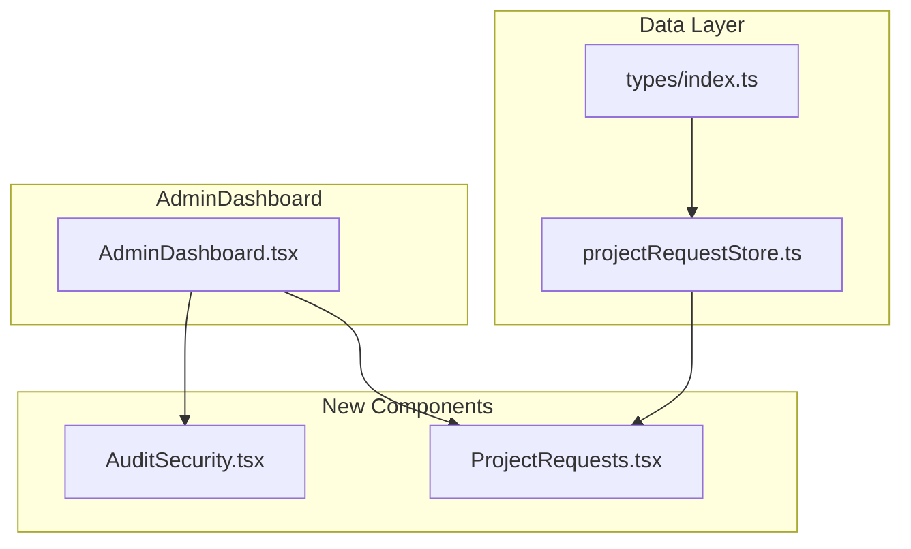

# Implementation Plan: Two New Admin Sections

## Overview
Create two new admin sections for the Architex Axis Admin Dashboard:
1. **AuditSecurity** - Audit logs, security events, and reporting
2. **ProjectRequests** - Manage project requests from clients

## Architecture



## Step-by-Step Implementation

### 1. Add ProjectRequest Type (src/types/index.ts)
```typescript
export type ProjectRequestStatus = 'pending' | 'approved' | 'rejected' | 'converted';

export interface ProjectRequest {
  id: string;
  clientId: string;
  clientName: string;
  freelancerId?: string;
  freelancerName?: string;
  projectName: string;
  description: string;
  projectType: 'residential' | 'commercial' | 'industrial' | 'landscape';
  hoursRequested: number;
  budget: number;
  status: ProjectRequestStatus;
  address?: string;
  createdAt: Date;
  updatedAt: Date;
  approvedBy?: string;
  approvedAt?: Date;
  rejectedBy?: string;
  rejectedAt?: Date;
  rejectionReason?: string;
  convertedToProjectId?: string;
  convertedAt?: Date;
}
```

### 2. Create projectRequestStore (src/store/projectRequestStore.ts)
- Follow existing store pattern (like projectStore.ts)
- Include mock data for demonstration
- Actions: createRequest, approveRequest, rejectRequest, convertToProject

### 3. Export Store (src/store/index.ts)
Add: `export { useProjectRequestStore } from './projectRequestStore';`

### 4. Create AuditSecurity.tsx
**Features:**
- Tabs: Audit Logs | Security Events | Reports
- Filters: User, Category, Severity, Date Range
- Table columns: Actor, Date, Action, Category, Severity, Status
- Action buttons: Export Logs, Generate Security Report

**UI Components:**
- Tabs from @/components/ui/tabs
- Table from @/components/ui/table
- Select for filters
- Buttons for actions

### 5. Create ProjectRequests.tsx
**Features:**
- Tabs: All | Pending | Approved | Rejected | Converted
- Approve/Reject action buttons per request
- Empty state when no requests
- Request details in table format

**UI Components:**
- Tabs for filtering by status
- Table with request details
- Dialog for approve/reject actions

### 6. Register Routes in AdminDashboard.tsx
**Changes needed:**
1. Add imports for new components
2. Add sidebar items
3. Add Route definitions

**Sidebar items:**
```typescript
{ path: 'audit-security', label: 'Audit & Security', icon: Shield },
{ path: 'project-requests', label: 'Project Requests', icon: FolderInput },
```

## Files to Create/Modify

| File | Action |
|------|--------|
| src/types/index.ts | Add ProjectRequest type |
| src/store/projectRequestStore.ts | Create new store |
| src/store/index.ts | Export new store |
| src/sections/admin/AuditSecurity.tsx | Create new component |
| src/sections/admin/ProjectRequests.tsx | Create new component |
| src/screens/AdminDashboard.tsx | Add routes and sidebar items |

## Design Decisions

1. **Mock Data**: Both sections will include realistic mock data for demonstration
2. **Empty States**: ProjectRequests will show empty state when no requests match filter
3. **Icons**: Using lucide-react icons - Shield for Audit, FolderInput for Project Requests
4. **Styling**: Following existing admin section patterns (Card, Table, Tabs)
5. **State Management**: Using Zustand store pattern consistent with existing code
