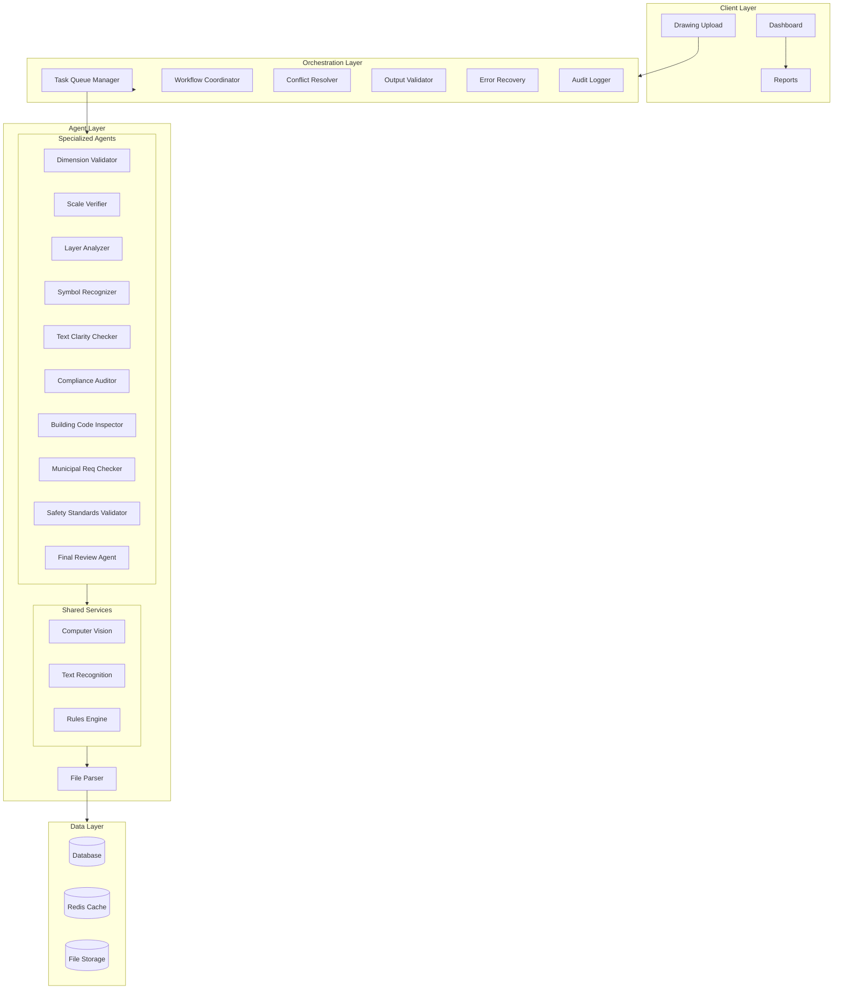
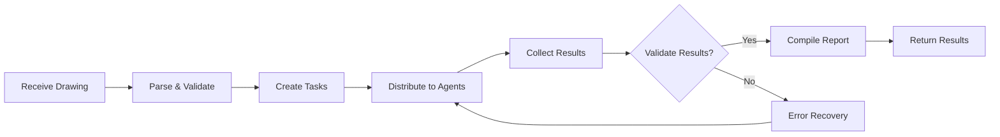

# AI Agent System - Production Implementation Plan

## Executive Summary

This document outlines a comprehensive plan to implement a production-grade AI Agent System for evaluating architectural drawing submissions. The system will serve as an intelligent verification and orchestration layer with autonomous agents, central coordination, comprehensive testing, and audit capabilities.

---

## System Architecture Overview



---

## Phase 1: Core Type Definitions & Base Classes

### 1.1 Agent Type System

Define comprehensive interfaces for all agent operations:

```typescript
// src/types/agent.ts
interface AgentConfig {
  id: string;
  name: string;
  type: AgentType;
  capabilities: string[];
  accuracy: number;
  threshold: number;
  timeout: number;
  retries: number;
}

interface AgentResult {
  agentId: string;
  status: AgentStatus;
  findings: Finding[];
  confidence: number;
  processingTime: number;
  metadata: Record<string, any>;
}

interface Finding {
  id: string;
  type: FindingType;
  severity: Severity;
  description: string;
  location: Location;
  suggestion?: string;
  evidence?: Evidence;
}
```

---

## Phase 2: Specialized Agent Implementation

### 2.1 Agent Categories

| Agent | Category | Primary Function |
|-------|----------|------------------|
| Dimension Validator | Validator | Verify all dimensions, lengths, widths, heights |
| Scale Verifier | Validator | Ensure correct scale throughout |
| Layer Analyzer | Analyzer | Validate layer structure and naming |
| Symbol Recognizer | Analyzer | Verify architectural symbols |
| Text Clarity Checker | Reviewer | Verify text legibility |
| Compliance Auditor | Compliance | Check SANS standards |
| Building Code Inspector | Compliance | Validate SA building codes |
| Municipal Requirements | Compliance | Verify local regulations |
| Safety Standards Validator | Validator | Check safety requirements |
| Final Review Agent | Reviewer | Comprehensive final inspection |

### 2.2 Agent Base Class

Common functionality for all agents:
- Configuration management
- State management (active/idle/paused/error)
- Metrics tracking (checks today, total checks, accuracy)
- Error handling and retry logic
- Result standardization

---

## Phase 3: Orchestrator Implementation

### 3.1 Core Orchestrator Responsibilities



### 3.2 Task Queue Management

- Priority-based task scheduling
- Concurrent agent execution
- Task timeout handling
- Resource allocation

### 3.3 Conflict Resolution

1. Detect conflicting findings from agents
2. Re-delegate to original agent for verification
3. If still conflicting, escalate to admin
4. Log all conflicts and resolutions

### 3.4 Error Recovery

- Automatic retry with exponential backoff
- Circuit breaker pattern for failing agents
- Fallback to alternative agents
- Graceful degradation

---

## Phase 4: Compliance & Validation

### 4.1 South African Standards

- SANS 10160: Load-bearing structures
- SANS 10400: Building regulations
- SANS 10142: Electrical installations
- National Building Regulations
- Municipal bylaws

### 4.2 Validation Rules Engine

- Configurable rule definitions
- Rule priority and dependencies
- Custom rule support
- Version control for regulations

---

## Phase 5: Testing Strategy

### 5.1 Unit Tests

- Each agent individually
- Orchestrator components
- Utilities and helpers

### 5.2 Integration Tests

- End-to-end drawing analysis flow
- Agent coordination
- Conflict resolution

### 5.3 Edge Cases & Failure Modes

| Scenario | Expected Behavior |
|----------|------------------|
| File format not supported | Return error, suggest conversion |
| Agent timeout | Retry or skip, log issue |
| All agents below threshold | Alert admin, manual review |
| Conflicting findings | Auto-resolve or escalate |
| Network failure | Queue task, retry later |
| Invalid dimensions | Flag as critical issue |

### 5.4 Performance Tests

- Concurrent drawing processing
- Large file handling
- Response time benchmarks

---

## Phase 6: Reporting & Audit

### 6.1 Report Generation

- Comprehensive analysis reports
- Issue summaries with severity
- Recommendations for fixes
- Compliance status

### 6.2 Audit Trail

- All agent activities logged
- Timestamp tracking
- User actions recorded
- Export capabilities

---

## Phase 7: Integration Points

### 7.1 External Systems

- CAD tool integrations
- Document management systems
- Municipal submission portals
- Payment systems

### 7.2 API Endpoints

```
POST   /api/agents/analyze         - Submit drawing
GET    /api/agents/results/:id     - Get results
POST   /api/agents/override        - Override decision
GET    /api/agents/accuracy        - Get metrics
GET    /api/agents/health          - System health
POST   /api/agents/config          - Update config
```

---

## Implementation Priority

1. **Foundation** (Types, Base Classes, Parser)
2. **Core Agents** (Dimension, Scale, Layer, Symbol)
3. **Compliance Agents** (SANS, Building Code, Municipal)
4. **Orchestrator** (Queue, Coordination, Conflict)
5. **Quality** (Testing, Validation, Error Handling)
6. **Reporting** (Audit, Analytics)
7. **Integration** (External systems)

---

## Success Metrics

- Agent accuracy: ≥98%
- Processing time: <5 minutes per drawing
- Concurrent analyses: 100+
- System availability: 99.9%
- False positive rate: <2%
